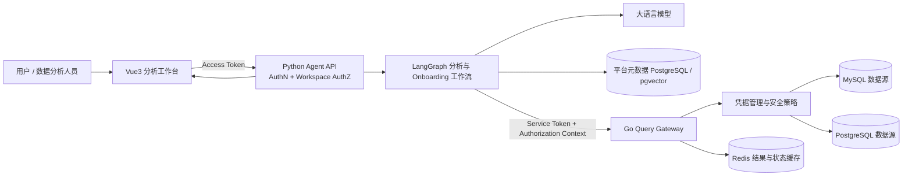
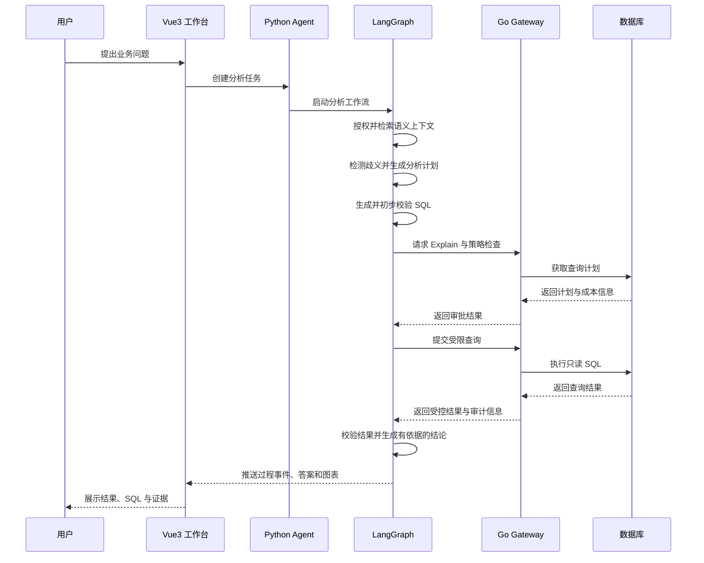

<div align="center">

# Quelyra

### 面向真实数据库的可信 AI 数据分析助手

用自然语言理解业务问题，自动生成并安全执行 SQL，将查询结果转化为可追溯的结论与可视化图表。

`自然语言分析` · `Text-to-SQL` · `语义层` · `安全查询网关` · `结果溯源` · `Agent 评测`

<!-- 项目完成后在此加入 CI、许可证、Python、Go、Vue 等真实徽章。 -->
<!-- 项目完成后在此加入产品截图、演示视频和在线体验地址。 -->

</div>

## 项目简介

Quelyra 是一个通用的 AI-SQL 数据分析平台。用户接入已有的 MySQL 或 PostgreSQL 数据库后，平台会扫描数据库结构、辅助构建业务语义层，并通过对话完成指标查询、趋势分析、异常发现和结果解释。

它不仅解决“如何把自然语言转换成 SQL”，还关注一套 AI 数据分析系统真正落地时必须面对的问题：

- 模型是否理解了表之间的关系和业务指标？
- 生成的 SQL 是否只读、安全并且不会拖垮生产数据库？
- 最终结论能否追溯到实际执行的 SQL 和查询结果？
- 多轮分析中如何处理歧义、澄清问题和上下文变化？
- Agent 的准确率、安全性、延迟和调用成本如何持续评估？

Quelyra 通过“Python 智能编排 + Go 安全执行 + Vue3 交互工作台”的方式，将推理能力和数据库安全边界明确分离。

## 核心能力

### 用户认证与多租户工作区

- 用户使用邮箱和密码注册，系统自动创建个人工作区并授予 `owner` 角色。
- 使用短期 Access Token、可轮换 Refresh Token 和可撤销会话完成登录态管理。
- 第一版固定使用 `owner`、`admin`、`analyst` 三种角色。
- 数据源、语义模型、会话、分析任务和审计记录均以 `workspace_id` 隔离。
- Agent API 负责面向用户的身份认证与工作区授权；Query Gateway 验证内部服务身份，并重新校验数据源的工作区归属。

### 数据源接入与自动 Onboarding

- 接入 MySQL、PostgreSQL 等关系型数据库。
- 扫描 Schema、表、字段、索引、主外键和基础统计信息。
- 自动推测表关系、字段含义、指标与维度，并交由用户审核。
- 将审核后的业务定义发布为带版本的语义模型。

### 多轮数据分析 Agent

- 理解自然语言问题并结合会话上下文补全分析意图。
- 在业务定义不明确时主动澄清，而不是直接猜测。
- 先生成结构化分析计划，再生成、验证并执行 SQL。
- 根据实际查询结果生成结论、证据说明和图表规格。

### 安全查询网关

- 数据库凭据由 Go Gateway 集中加密和管理，不暴露给模型。
- 强制执行只读策略、语句类型限制和目标主机白名单。
- 支持执行前 `EXPLAIN`、成本检查、超时、行数和并发限制。
- 支持字段脱敏、查询取消、结果过期和完整审计记录。

### SQL方言与数据库适配

- Python根据DataSource的Engine、版本和Schema直接生成目标方言SQL，并使用SQLGlot按该Dialect解析和校验。
- Go根据平台库中的权威Engine选择MySQL或PostgreSQL Connector与Driver，并拒绝请求Dialect不一致的查询。
- 每个Connector分别适配DSN、元数据扫描、EXPLAIN、只读事务、Timeout、Cancel和类型归一化。
- 新增数据库需要同时完成Python方言适配、Go Connector适配和真实数据库集成测试，不能只安装一个Driver。
- MVP先完成MySQL纵向闭环，再用PostgreSQL验证抽象；Oracle等数据库不在第一版范围内。

### 有依据的分析结果

- 保存问题、分析计划、生成 SQL、执行结果和最终回答之间的关联。
- 重要结论必须能够回溯到真实查询结果。
- 展示 SQL、执行状态、数据范围和图表生成依据。
- 避免模型在没有数据支持时生成看似合理的业务结论。

### 可复现的 Agent 评测

- 使用固定数据集和问题集评估端到端表现。
- 分别衡量 SQL 正确性、执行成功率、结果一致性和回答忠实度。
- 记录模型、Prompt、语义模型和策略版本，支持结果回归比较。
- 同时跟踪延迟、Token 消耗、模型成本和安全策略命中情况。

## 系统架构



三个应用位于同一个 Monorepo，但保持独立的依赖、进程和部署单元：

| 应用 | 主要职责 | 不负责的内容 |
| --- | --- | --- |
| Vue3 Web | 数据源接入、语义审核、对话分析、结果与审计展示 | 不保存数据库凭据，不直接连接客户数据库 |
| Python Agent API | HTTP API、LangGraph 编排、上下文检索、语义解析、SQL 生成、答案与评测 | 不持有明文凭据，不绕过 Gateway 执行 SQL |
| Go Query Gateway | 凭据、数据库连接、SQL 策略、Explain、受限执行、取消、脱敏与审计 | 不进行大模型推理，不承担对话编排 |

## 一次分析如何完成



## 技术栈

| 领域 | 技术 | 用途 |
| --- | --- | --- |
| 前端 | Vue 3、TypeScript、Vite、Vue Router、Pinia | 分析工作台与交互状态管理 |
| Agent API | Python、FastAPI、Pydantic | 公共 API、任务管理与应用服务 |
| Agent 编排 | LangGraph、LangChain 适配器 | 可恢复、有状态的分析和 Onboarding 工作流 |
| 查询网关 | Go、Gin | 数据库安全边界与受限查询执行 |
| 平台数据库 | PostgreSQL、pgvector | 用户、登录会话、工作区、成员关系、邀请、语义模型、任务和向量检索 |
| 缓存与结果 | Redis | 短期结果、事件状态与资源控制 |
| 数据库接入 | MySQL、PostgreSQL | 第一阶段支持的业务数据源 |
| 契约 | OpenAPI、JSON Schema | 前后端与内部服务的版本化接口 |
| 可观测性 | OpenTelemetry、Prometheus | 日志、链路、指标和成本追踪 |
| 工程化 | Docker Compose、GitHub Actions | 本地环境、测试与持续集成 |

## 项目结构

```text
quelyra/
├── apps/
│   └── web/                         # Vue3 数据分析工作台
├── services/
│   ├── agent-api/                   # Python FastAPI + LangGraph
│   │   ├── src/quelyra_agent/
│   │   │   ├── api/                 # HTTP 接口适配层
│   │   │   ├── domain/              # 框架无关的领域模型
│   │   │   ├── graphs/              # Analysis 与 Onboarding 工作流
│   │   │   ├── services/            # 应用服务
│   │   │   ├── clients/             # Gateway 与模型客户端
│   │   │   ├── repositories/        # 平台元数据持久化
│   │   │   └── jobs/                # 持久化后台任务
│   │   └── tests/
│   └── query-gateway/               # Go 安全查询网关
│       ├── cmd/server/               # 进程入口
│       ├── internal/api/             # Gin 路由、中间件和 Handler
│       ├── internal/application/     # 查询网关用例编排
│       ├── internal/domain/          # 网关领域模型
│       ├── internal/connector/       # MySQL/PostgreSQL 连接器
│       ├── internal/policy/          # SQL 安全策略
│       └── tests/
├── packages/
│   ├── contracts/                    # Public/Internal OpenAPI 与 Schema
│   └── ui-contracts/                 # 前端共享事件与图表契约
├── demo/
│   ├── ecommerce/                    # 电商演示数据域
│   └── traffic-analytics/            # 流量分析演示数据域
├── evals/                            # 数据集、基线、运行器、评分器和报告
├── deploy/                           # Docker 与可观测性配置
├── docs/                             # 架构、API、ADR、安全和运维文档
├── scripts/                          # 跨服务开发脚本
├── docker-compose.yml
└── Makefile
```

详细边界请参考：

- [`services/agent-api`](services/agent-api/README.md)：Python Agent 服务说明。
- [`services/query-gateway`](services/query-gateway/README.md)：Go 查询网关说明。
- [`apps/web`](apps/web/README.md)：Vue3 工作台说明。
- [`packages/contracts`](packages/contracts/README.md)：接口契约管理约定。
- [`evals`](evals/README.md)：Agent 评测体系说明。

## 快速开始

### 环境要求

- Docker 与 Docker Compose
- Python 3.12+
- Go 1.23+
- Node.js 22+
- pnpm 10+

仅使用 Docker 运行完整环境时，不需要在宿主机单独安装 Python、Go 和 Node.js。

### 启动本地环境

```bash
git clone https://github.com/<your-account>/quelyra.git
cd quelyra
cp .env.example .env
docker compose up -d --build
```

服务启动后，可通过以下入口使用系统：

| 服务 | 默认地址 |
| --- | --- |
| Quelyra Web | `http://localhost:5173` |
| Agent API | `http://localhost:8000` |
| OpenAPI 文档 | `http://localhost:8000/docs` |
| Query Gateway | 仅供内部服务网络访问 |

> 正式公开仓库前，应根据最终 Compose 配置核对端口、健康检查和仓库地址。

## 配置

所有项目自定义环境变量统一使用 `QUELYRA_` 前缀。复制 `.env.example` 后，根据注释配置模型、数据库和安全参数。

```dotenv
# 模型服务、平台数据库、Redis、密钥和网关策略将在 .env.example 中集中维护。
```

请勿提交真实数据库密码、模型 API Key、加密密钥或生产网络地址。

## 安全设计

Quelyra 将 Go Query Gateway 作为客户数据库前的强制安全边界：

1. 模型与 Python Agent 只接触凭据引用，不接触数据库明文密码。
2. 所有查询必须经过语句分类、只读校验、资源限制和授权检查。
3. 高风险或高成本 SQL 在执行前通过 `EXPLAIN` 进行拦截。
4. 查询设置超时、最大行数、最大返回字节数和并发额度。
5. 结果离开 Gateway 前执行配置化字段脱敏。
6. 连接、策略决定、Explain、执行、取消和结果访问均写入审计日志。

应用层 SQL 校验用于提升反馈质量，Gateway 策略才是不可绕过的最终执行边界。

## 评测体系

`evals/` 保存版本化问题集、预期结果、基线输出、评分器和评测报告。主要指标包括：

- SQL 语法与方言正确率。
- SQL 执行成功率。
- 查询结果一致性，而不只比较 SQL 字符串。
- 回答对查询结果的忠实度和引用完整性。
- 歧义识别与合理澄清率。
- 危险 SQL、越权数据和高成本查询拦截率。
- 端到端延迟、模型调用次数、Token 与成本。

每份报告同时记录模型版本、Prompt 版本、语义模型版本、数据集版本和安全策略版本，确保结果可复现、可比较。

## 开发约定

- OpenAPI 是前后端和内部服务的契约来源，生成类型禁止手工修改。
- LangGraph Node 只负责编排步骤，通过 Service 或 Client 访问外部系统。
- Python Domain 不依赖 FastAPI、LangGraph 或 ORM。
- Go Handler 只处理 HTTP 映射，安全策略不依赖 Gin。
- Vue 通用组件与业务 Feature 分离，路由页面只负责页面级组合。
- Prompt 以版本化模板保存，不散落在 Python 字符串中。
- 新功能必须同时考虑单元测试、契约测试和端到端评测。

## 路线图

- [ ] 完成 Monorepo 基础工程、健康检查、Docker Compose 与 CI。
- [ ] 完成注册登录、会话轮换、工作区成员和最小 RBAC。
- [ ] 完成工作区、数据源和凭据管理。
- [ ] 完成 MySQL/PostgreSQL Schema 扫描与语义模型 Onboarding。
- [ ] 完成基础 Text-to-SQL 分析闭环。
- [ ] 完成 Explain、查询限制、脱敏、取消和审计能力。
- [ ] 完成多轮澄清、结果溯源和图表生成。
- [ ] 建立可复现评测集与回归报告。
- [ ] 完成电商与流量分析双领域演示。
- [ ] 完善可观测性、部署文档和公开演示环境。

## 常见问题

### 为什么不直接使用 `create_sql_agent`？

通用 SQL Agent 适合快速验证能力，但 Quelyra 需要明确的状态机、可恢复任务、语义模型、执行前审批、强制安全网关、结果溯源和系统化评测。框架负责模型与工具适配，核心业务流程和安全边界由项目显式实现。

### 为什么 Python、Go 和 Vue3 放在同一个仓库？

Quelyra 使用 Monorepo 统一管理接口契约、演示数据、评测和本地环境，但三个应用仍独立安装依赖、构建镜像、运行和扩容。项目进入多团队、独立发布阶段后，可以按服务边界拆分仓库。

### 为什么需要 Go Query Gateway？

Python 更适合模型生态和 Agent 编排；Go 适合构建职责单一、并发可控、资源边界明确的数据库执行服务。Gateway 不是普通业务后端，而是数据库凭据和查询执行的安全边界。

### Quelyra 是否只能服务某一个业务系统？

不是。平台通过数据源 Onboarding 和可审核的语义模型适配不同数据库。电商和流量分析是用于验证通用性的演示领域，不是写死在 Agent 中的业务逻辑。

## 许可证

项目许可证将在首次公开发布前确定。在许可证文件正式加入仓库前，默认保留全部权利。

## 致谢

Quelyra 的工程设计受到 FastAPI、LangGraph、Gin、Vue、OpenAPI、OpenTelemetry 等开源项目和社区实践的启发。

---

<div align="center">

让数据库分析从“会写 SQL”变成“能够提出问题，并获得可信答案”。

</div>
